# WPGraphQL Subscriptions

> [!WARNING]
> **EXPERIMENTAL PLUGIN.** This plugin is in active development and should be used with caution. It's not recommended for production environments without thorough testing.

An experimental WordPress plugin that adds GraphQL Subscriptions support to WPGraphQL, enabling real-time updates through Server-Sent Events (SSE).

## Overview

This plugin extends WPGraphQL to support GraphQL Subscriptions, allowing clients to receive real-time updates when WordPress content changes. It provides a reference implementation for real-time messaging in WordPress using native WordPress technologies (no external services required).

## Architecture: Universal Event Bus

The plugin is built around a **universal WordPress event bus** that can power multiple systems:

```mermaid
graph TD
    subgraph "WordPress Core Events"
        WP["WordPress Hooks<br/>post_updated, comment_post, etc."] --> Emitter["WPGraphQL_Event_Emitter<br/>✅ Generic & Reusable"]
    end
    
    subgraph "Multiple Consumers"
        Emitter --> |"wpgraphql_generic_event"| GraphQL["GraphQL Subscription<br/>Channel Mapper<br/>→ SSE-2 Server"]
        Emitter --> |"wpgraphql_generic_event"| Cache["WPGraphQL Smart Cache<br/>→ Varnish Purging"]
        Emitter --> |"wpgraphql_generic_event"| Debug["Debug Webhook<br/>→ webhook.site"]
        Emitter --> |"wpgraphql_generic_event"| Analytics["Analytics System<br/>→ Track Content Changes"]
        Emitter --> |"wpgraphql_generic_event"| Custom["Custom Plugin<br/>→ Any Use Case"]
    end
    
    subgraph "Downstream Systems"
        GraphQL --> SSE["SSE-2 Server<br/>Real-time Subscriptions"]
        Cache --> Varnish["Varnish Cache<br/>Smart Purging"]
        Debug --> WebhookSite["webhook.site<br/>Event Debugging"]
        Analytics --> Dashboard["Analytics Dashboard<br/>Content Insights"]
        Custom --> Integration["3rd Party Integration<br/>Zapier, etc."]
    end
    
    classDef core fill:#e3f2fd,stroke:#2196f3,color:#000
    classDef consumers fill:#f3e5f5,stroke:#9c27b0,color:#000
    classDef systems fill:#e8f5e8,stroke:#4caf50,color:#000
    
    class WP,Emitter core
    class GraphQL,Cache,Debug,Analytics,Custom consumers
    class SSE,Varnish,WebhookSite,Dashboard,Integration systems
```



### Key Benefits

- **🔄 Reusable Event System**: The `WPGraphQL_Event_Emitter` creates generic WordPress events that any plugin can consume
- **🎯 Separation of Concerns**: GraphQL subscriptions are just one consumer of the universal event bus
- **🔌 Plugin Ecosystem**: Other plugins can hook into `wpgraphql_generic_event` for cache invalidation, analytics, webhooks, etc.
- **⚡ Schema-Agnostic SSE Server**: The SSE-2 server has zero schema knowledge - it just publishes to whatever channels WordPress provides

## 🚀 Quick Demo

Want to see GraphQL subscriptions in action? After installing the plugin:

1. Navigate to `/wp-content/plugins/wp-graphql-subscriptions/client/test-demos.html`
2. Choose any of the 4 working demos
3. Follow the on-screen instructions to connect and subscribe  
4. Update a post in WordPress admin and watch the real-time updates!

**Note**: This requires specific LocalWP configurations for multiple SSE connections. See [Development Setup](#development-setup) below for details.

## Features

### Server-Side (WordPress Plugin)
- ✅ **GraphQL Subscriptions Schema** - Adds `RootSubscription` type to WPGraphQL schema
- ✅ **Real-time Event System** - Centralized event tracking and emission
- ✅ **Server-Sent Events (SSE)** - HTTP-based real-time transport
- ✅ **Database Event Queue** - Reliable multi-process event handling
- ✅ **WordPress Native** - No external dependencies or services required
- ✅ **Multi-process Safe** - Works with PHP-FPM and multiple concurrent connections
- ✅ **Debug Tools** - Admin interface and WP-CLI commands for monitoring

### Client-Side (JavaScript Library)
- ✅ **GraphQL-SSE Client Library** - Ready-to-use JavaScript client (`/client/`)
- ✅ **Apollo Client Integration** - Drop-in support for React/Apollo apps
- ✅ **Framework Agnostic** - Works with React, Vue, Angular, or vanilla JS
- ✅ **Automatic Reconnection** - Exponential backoff with configurable retry
- ✅ **Multiple Working Demos** - 4 complete examples: Production Build (Vite+TypeScript), Apollo React, React Simple, and Vanilla JS
- ✅ **Production Ready Examples** - TypeScript, modern build tools, and real Apollo Client integration

## Current Status

### ✅ Working Features
- **GraphQL-SSE Protocol Compliance** - Full implementation of the GraphQL-SSE specification
- **Database Subscription Storage** - Cross-process subscription document persistence
- **Post Update Subscriptions** - `postUpdated(id: "123")` with argument filtering
- **Real-time SSE Streaming** - Server-Sent Events with proper headers and connection management
- **Event Emission System** - WordPress hooks automatically trigger subscription events
- **Database Event Queue** - Reliable multi-process event storage and retrieval
- **GraphQL Query Execution** - Full WPGraphQL integration with proper field resolution
- **Multiple Concurrent Connections** - Supports many simultaneous SSE connections
- **Connection Management** - Token-based connections with automatic expiry
- **Admin Monitoring Interface** - Debug tools and queue management
- **WP-CLI Management Commands** - Command-line tools for testing and maintenance

### 🚧 In Development
- **`register_graphql_subscription()` API** - Developer-friendly subscription registration
- User authentication/authorization for subscriptions
- Additional subscription types (comments, users, taxonomies, etc.)
- WebSocket transport option
- Production optimization and scaling

### 📋 Planned Features
- Client-side subscription management libraries
- Rate limiting and connection throttling
- Redis/external cache support for high-scale deployments
- WebSocket transport alongside SSE

## Installation

1. Download or clone this repository to your `wp-content/plugins/` directory
2. Ensure you have WPGraphQL installed and activated
3. Activate the "WPGraphQL Subscriptions" plugin
4. The plugin will automatically create the required database table

## Basic Usage

### 1. GraphQL-SSE Protocol Usage

The plugin implements the [GraphQL-SSE specification](https://github.com/enisdenjo/graphql-sse/blob/master/PROTOCOL.md) for real-time subscriptions.

#### Make a Reservation (PUT)
```javascript
const response = await fetch('/graphql/stream', {
  method: 'PUT'
});
const token = await response.text(); // Connection token
```

#### Execute GraphQL Operation (POST)
```javascript
const response = await fetch('/graphql/stream', {
  method: 'POST',
  headers: {
    'Content-Type': 'application/json',
    'X-GraphQL-Event-Stream-Token': token
  },
  body: JSON.stringify({
    query: `subscription {
      postUpdated(id: "394") {
        id
        title
        status
        content
        date
        modified
        author {
          node {
            id
            name
          }
        }
      }
    }`,
    extensions: {
      operationId: 'my-subscription-001'
    }
  })
});
```

#### Establish SSE Connection (GET)
```javascript
const eventSource = new EventSource(`/graphql/stream?token=${token}`);

eventSource.addEventListener('next', function(event) {
  const data = JSON.parse(event.data);
  console.log('GraphQL result:', data.payload);
  /*
  Example result:
  {
    "data": {
      "postUpdated": {
        "id": "cG9zdDozOTQ=",
        "title": "My Updated Post",
        "status": "publish",
        "content": "<p>Updated content...</p>",
        "date": "2025-08-07T20:26:32",
        "modified": "2025-08-07T20:55:03",
        "author": {
          "node": {
            "id": "dXNlcjox",
            "name": "jasonbahl"
          }
        }
      }
    }
  }
  */
});

eventSource.addEventListener('test', function(event) {
  console.log('Connection test:', JSON.parse(event.data));
});
```

### 3. Test Events

Update any WordPress post and connected clients will receive real-time notifications.

## Architecture

### Event Flow

```
WordPress Hook → Event Emitter → Database Queue → SSE Streams → Clients
```

1. **WordPress Events** - Standard WP hooks (`wp_insert_post`, etc.)
2. **Event Emitter** - Standardizes and emits subscription events
3. **Database Queue** - Stores events for reliable multi-process delivery
4. **SSE Streams** - Long-running HTTP connections that poll for events
5. **Client Applications** - Receive real-time GraphQL subscription results

### Key Components

- **`WPGraphQL_Event_Emitter`** - Central event emission system
- **`WPGraphQL_Event_Queue`** - Database-backed event storage
- **`WPGraphQL_Subscriptions_Stream`** - SSE endpoint handler
- **`WPGraphQL_Subscription_Manager`** - Plugin coordination and schema registration

## Configuration

### PHP-FPM Settings

For multiple concurrent SSE connections, ensure adequate PHP-FPM workers:

```ini
; In your PHP-FPM pool configuration
pm = dynamic
pm.max_children = 10        ; Increase from default
pm.start_servers = 3
pm.min_spare_servers = 2
pm.max_spare_servers = 5
```

### WordPress Settings

No special WordPress configuration required. The plugin works with standard WordPress installations.

## Development

### File Structure

```
wp-graphql-subscriptions/
├── wp-graphql-subscriptions.php          # Main plugin file
├── README.md
├── docs/                                 # Documentation
├── includes/
│   ├── class-wpgraphql-event-emitter.php       # Event emission
│   ├── class-wpgraphql-event-queue.php         # Database queue
│   ├── class-wpgraphql-subscriptions-stream.php # SSE handler
│   ├── class-wpgraphql-subscription-manager.php # Plugin manager
│   ├── event-stream.php                         # SSE routing
│   ├── events.php                               # WordPress event hooks
│   ├── plugin-init.php                          # Plugin initialization
│   ├── schema.php                               # GraphQL schema additions
│   └── transport-webhook.php                    # Webhook transport (optional)
└── LICENSE
```

## Client-Side Usage

### JavaScript Client Library

The plugin includes a complete JavaScript client library for easy integration with any frontend application:

#### Apollo Client Integration
```javascript
import { GraphQLSSELink } from './client/graphql-sse-client.js';
import { ApolloClient, InMemoryCache } from '@apollo/client';

const sseLink = new GraphQLSSELink({
  baseUrl: '/graphql/stream'
});

const client = new ApolloClient({
  link: sseLink,
  cache: new InMemoryCache()
});

// Use with React hooks
const { data } = useSubscription(gql`
  subscription {
    postUpdated(id: "123") {
      id
      title
      modified
    }
  }
`);
```

#### Vanilla JavaScript
```javascript
import { GraphQLSSEClient } from './client/graphql-sse-client.js';

const client = new GraphQLSSEClient({
  baseUrl: '/graphql/stream'
});

await client.makeReservation();
await client.connect();

const subscription = await client.subscribe(
  'my-subscription',
  'subscription { postUpdated(id: "123") { id title } }'
);

subscription.subscribe({
  next: (data) => console.log('Update:', data),
  error: (error) => console.error('Error:', error)
});
```

#### Live Demos

**🎉 All 4 demos are fully working!**

- **🏗️ Production Build Demo**: `cd client/demo-build && npm install && npm run dev`
  - **Recommended**: Full Vite + TypeScript + Real Apollo Client setup
  - Production-ready with modern build tools and proper development workflow
- **⚛️ Apollo React Demo**: Open `/client/demo-apollo-react.html`
  - Browser-based Apollo-compatible client with React hooks
- **⚛️ React Simple Demo**: Open `/client/demo-react-simple.html` 
  - React with direct GraphQL-SSE client integration (no Apollo)
- **🔧 Vanilla JS Demo**: Open `/client/demo-vanilla-js.html`
  - Pure JavaScript implementation for educational purposes

**Demo Landing Page**: Open `/client/test-demos.html` to access all demos with setup instructions.

See `/client/README.md` for complete documentation and examples.

### WP-CLI Commands

```bash
# View queue statistics
wp wpgraphql subscription stats

# Test event emission
wp wpgraphql subscription test-event --type=postUpdated --node-id=123

# Clean up old events and expired connections
wp wpgraphql subscription cleanup --hours=1 --connections

# Create database table
wp wpgraphql subscription create-table
```

### Debug Mode

Enable debug mode by adding to your `wp-config.php`:

```php
// Enable WPGraphQL debug mode to see admin interfaces
define('GRAPHQL_DEBUG', true);
```

Then visit **GraphQL → Subscription Queue** in WordPress admin.

## Troubleshooting

### Multiple Connections Freezing

This usually indicates PHP-FPM process pool exhaustion. Increase `pm.max_children` in your PHP-FPM configuration.

### Events Not Appearing in Streams

1. Check that database tables exist:
   ```sql
   SHOW TABLES LIKE 'wp_wpgraphql_subscription_events';
   SHOW TABLES LIKE 'wp_wpgraphql_subscription_connections'; 
   SHOW TABLES LIKE 'wp_wpgraphql_subscription_documents';
   ```
2. Verify events are being stored: `SELECT * FROM wp_wpgraphql_subscription_events ORDER BY created_at DESC LIMIT 10`
3. Check subscriptions are registered: `SELECT * FROM wp_wpgraphql_subscription_documents`
4. Check error logs for PHP or database errors

### Session Blocking Issues

The plugin automatically calls `session_write_close()` to prevent session locking. If you're still experiencing issues, ensure no other plugins are starting sessions after the SSE stream begins.

## Scaling & Performance Considerations

### Database Load Concerns

⚠️ **Important**: The current database-based storage is designed for **development and small-to-medium production sites**. For high-traffic scenarios, consider these scaling implications:

#### Event Queue Load
```sql
-- High-frequency events can generate significant database writes
INSERT INTO wp_wpgraphql_subscription_events (event_type, node_id, data, created_at)
-- Every post update, comment, user change, etc.
```

#### Connection Storage Load  
```sql
-- Every SSE connection queries these tables every second
SELECT * FROM wp_wpgraphql_subscription_connections WHERE token = ?;
SELECT * FROM wp_wpgraphql_subscription_documents WHERE connection_token = ?;
```

### Performance Recommendations by Scale

#### **Small Sites (< 10 concurrent SSE connections)**
- ✅ **Database storage is fine** - Current implementation works well
- ✅ **Default cleanup intervals** - Hourly cleanup sufficient

#### **Medium Sites (10-100 concurrent connections)**  
- ⚠️ **Monitor database performance** - Watch for slow queries
- ⚠️ **Optimize cleanup frequency** - Consider 15-minute intervals
- ⚠️ **Database indexing** - Ensure proper indexes on timestamp columns

#### **Large Sites (100+ concurrent connections)**
- ❌ **Database storage not recommended** - Switch to Redis/Memcached
- ❌ **High database load risk** - Event queue writes + connection polling
- ✅ **External storage required** - Redis, Memcached, or custom solution

### Recommended Storage Alternatives

#### Redis Implementation
```php
// Example Redis storage backend
add_filter('wpgraphql_subscription_storage', function() {
    return new WPGraphQL_Subscription_Redis_Storage([
        'host' => 'redis-server',
        'port' => 6379,
        'ttl' => 86400 // 24 hours
    ]);
});
```

#### Benefits of Redis/External Storage:
- 🚀 **Much faster** - In-memory operations vs database queries
- 🔄 **Automatic expiry** - TTL-based cleanup, no cron jobs needed  
- 📈 **Better scaling** - Handles thousands of concurrent connections
- 🌐 **Multi-server support** - Shared storage across multiple WordPress instances

### Monitoring & Optimization

#### Database Query Monitoring
```sql
-- Monitor slow queries related to subscriptions
SHOW PROCESSLIST;
SELECT * FROM information_schema.PROCESSLIST WHERE INFO LIKE '%wpgraphql_subscription%';
```

#### Key Metrics to Watch
- Database connection pool usage
- Query execution times on subscription tables
- Memory usage of long-running SSE processes
- Event queue growth rate

#### Optimization Tips
```php
// Reduce event queue retention
add_filter('wpgraphql_subscription_event_retention_hours', function() {
    return 1; // Keep events for 1 hour instead of 24
});

// Increase cleanup frequency  
wp_clear_scheduled_hook('wpgraphql_subscription_cleanup');
wp_schedule_event(time(), 'every_15_minutes', 'wpgraphql_subscription_cleanup');
```

## Contributing

This is an experimental plugin and we welcome contributions! Please see our [Development Guide](docs/development.md) for more information.

### Current Focus Areas

1. **`register_graphql_subscription()` API** - Developer-friendly subscription registration system
2. **Additional Subscription Types** - Comments, users, taxonomies, custom post types
3. **Authentication & Authorization** - User permission checks for subscriptions  
4. **Performance & Scaling** - Optimizing for high-traffic scenarios
5. **Transport Options** - Adding WebSocket support alongside SSE

## License

GPL v3 or later. See [LICENSE](LICENSE) file for details.

## Changelog

### 0.3.0 - Current
- **✅ Database Subscription Persistence** - Cross-process subscription document storage
- **✅ Swappable Storage Interface** - Pluggable storage backends (Database, Redis, etc.)
- **✅ Connection Lifecycle Management** - Automatic connection expiry and cleanup
- **✅ Enhanced WP-CLI Commands** - Connection monitoring and cleanup tools
- **✅ Scheduled Cleanup** - Hourly cleanup of expired connections and subscriptions
- **✅ Modular Architecture** - Each class in its own file for better maintainability
- **✅ Complete Client-Side Library** - JavaScript GraphQL-SSE client with Apollo Link integration
- **✅ 4 Working Demo Applications** - Production Build (Vite+TypeScript), Apollo React, React Simple, Vanilla JS
- **✅ Subscription Confirmation Flow** - Proper Apollo Client loading state management
- **✅ Production-Ready Examples** - TypeScript, modern build tools, comprehensive documentation

### 0.2.0 - Previous
- **✅ GraphQL-SSE Protocol Compliance** - Full implementation of the GraphQL-SSE specification
- **✅ Working Post Subscriptions** - `postUpdated(id: "123")` with real-time data streaming
- **✅ Proper GraphQL Execution** - Full WPGraphQL integration with field resolution
- **✅ Connection Management** - Token-based reservations and SSE streaming
- **✅ Event Queue System** - Reliable database-backed event storage
- **✅ Multi-process Safety** - Works with PHP-FPM and concurrent connections
- **✅ Debug & Testing Tools** - HTML test client and comprehensive logging

### 0.1.0 - Previous
- Initial experimental release
- Basic subscription schema support
- SSE transport implementation  
- Database event queue system
- Multi-process compatibility
- Debug tools and monitoring