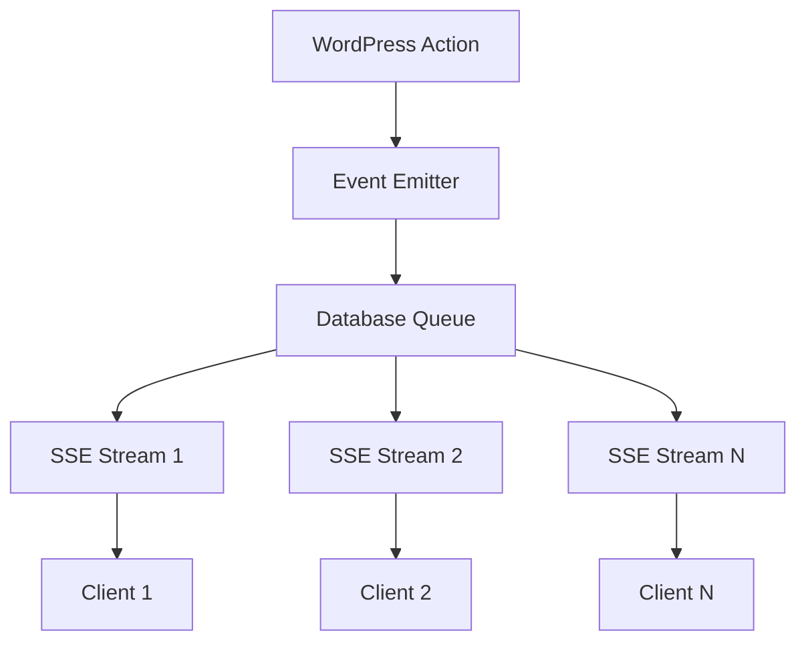

# Architecture Overview

## System Design

WPGraphQL Subscriptions implements a **database-backed event queue system** with **Server-Sent Events (SSE)** transport to provide real-time GraphQL subscriptions without external dependencies.

## High-Level Flow



## Core Components

### 1. Event Emission Layer

**File**: `includes/class-wpgraphql-event-emitter.php`

Provides a centralized event emission system that:
- Standardizes event payloads across different WordPress hooks
- Maps WordPress actions to GraphQL subscription types
- Validates and enriches event data
- Triggers the `graphql_subscription_event` action

**Example Usage**:
```php
WPGraphQL_Event_Emitter::emit(
    'post',           // node_type
    'UPDATE',         // action
    $post_id,         // node_id
    ['post' => $post], // context
    ['hook' => 'wp_insert_post'] // metadata
);
```

### 2. Database Event Queue

**File**: `includes/class-wpgraphql-event-queue.php`

A custom database table (`wp_wpgraphql_subscription_events`) that stores events for reliable multi-process delivery:

```sql
CREATE TABLE wp_wpgraphql_subscription_events (
    id bigint(20) unsigned NOT NULL AUTO_INCREMENT,
    subscription_type varchar(50) NOT NULL,
    node_id bigint(20) unsigned NULL,
    event_data longtext NOT NULL,
    created_at datetime NOT NULL,
    processed_at datetime NULL,
    PRIMARY KEY (id),
    KEY idx_subscription_type (subscription_type),
    KEY idx_created_at (created_at),
    KEY idx_node_id (node_id)
);
```

**Key Features**:
- Time-based event retrieval (events since timestamp)
- Automatic cleanup of old events
- Optimized indexes for fast lookups
- JSON storage of complete event payloads

### 3. SSE Stream Handler

**File**: `includes/class-wpgraphql-subscriptions-stream.php`

Manages long-running HTTP connections using Server-Sent Events:

**Responsibilities**:
- Maintains persistent HTTP connections
- Polls database queue for new events
- Converts internal events to GraphQL ExecutionResult format
- Handles client disconnection and cleanup

**Connection Flow**:
1. Client connects to `/path/to/site?gql_subscription=connection_id`
2. Stream closes PHP session to prevent blocking
3. Stream enters polling loop (1-second intervals)
4. Stream queries database for events since last check
5. Stream sends events as SSE data to client

### 4. WordPress Integration

**File**: `includes/events.php`

Hooks into WordPress actions to emit subscription events:

```php
add_action('post_updated', function($post_id, $post_after, $post_before) {
    WPGraphQL_Event_Emitter::emit('post', 'UPDATE', $post_id, [
        'post' => $post_after,
        'post_type' => $post_after->post_type
    ]);
});
```

### 5. GraphQL Schema Integration

**File**: `includes/schema.php`

Extends WPGraphQL schema with subscription support:

```php
register_graphql_object_type('RootSubscription', [
    'description' => 'Root subscription type',
    'fields' => []
]);

register_graphql_field('RootSubscription', 'postUpdated', [
    'type' => 'Post',
    'args' => ['id' => ['type' => 'ID']],
    'resolve' => function($root, $args) {
        return new \WPGraphQL\Model\Post(get_post($args['id']));
    }
]);
```

## Multi-Process Architecture

### Problem Solved

Traditional caching approaches (transients, object cache) fail in multi-process environments because:
- Each PHP-FPM worker has isolated memory
- Object caches aren't shared between processes
- Race conditions occur during concurrent access

### Solution: Database-Centric Design

```
Process 1 (SSE Stream A) ──┐
                           ├──> Database Queue ──> All Events
Process 2 (SSE Stream B) ──┘

Process 3 (Event Emission) ──> Database Queue
```

**Benefits**:
- All processes share the same database
- No cache invalidation issues
- Atomic database operations prevent race conditions
- Horizontal scaling across multiple PHP-FPM workers

## Event Lifecycle

### 1. Event Creation
```
WordPress Hook → Event Emitter → Database Insert
```

### 2. Event Delivery
```
SSE Stream Poll → Database Query → Event Conversion → Client Delivery
```

### 3. Event Cleanup
```
Cron Job → Delete Old Events (1+ hours old)
```

## Transport Layer: Server-Sent Events

### Why SSE?

1. **HTTP-based** - Works through firewalls and proxies
2. **Automatic reconnection** - Built into browsers
3. **Simple implementation** - No complex WebSocket handshaking
4. **WordPress-compatible** - Works with standard web servers

### SSE Protocol Implementation

```
Content-Type: text/event-stream
Cache-Control: no-cache
Connection: keep-alive

event: next
data: {"data": {"postUpdated": {"id": 123, "title": "Updated Post"}}}

event: heartbeat  
data: {"time": "2025-08-07T18:22:23Z", "pid": 1234}
```

### Client Handling

```javascript
const eventSource = new EventSource('/stream-endpoint');

eventSource.addEventListener('next', function(event) {
    const result = JSON.parse(event.data);
    // Handle GraphQL subscription result
});

eventSource.addEventListener('heartbeat', function(event) {
    const status = JSON.parse(event.data);
    // Connection keepalive
});
```

## Scaling Considerations

### Current Limits

- **PHP-FPM Worker Pool** - Limited by `pm.max_children` setting
- **Database Connections** - Limited by MySQL connection pool
- **Memory Usage** - Each SSE stream consumes one PHP process

### Scaling Strategies

1. **Horizontal PHP-FPM Scaling**
   ```ini
   pm.max_children = 50-100
   pm.start_servers = 10-20
   ```

2. **Database Optimization**
   ```sql
   -- Optimize event queries
   KEY idx_subscription_type_created (subscription_type, created_at)
   
   -- Regular cleanup
   DELETE FROM events WHERE created_at < NOW() - INTERVAL 1 HOUR
   ```

3. **Event Queue Partitioning** (Future)
   - Separate tables by subscription type
   - Redis/external queue for high-volume scenarios

## Security Model

### Current Implementation
- No authentication on SSE endpoints (development mode)
- Events contain full WordPress post data
- No rate limiting or connection restrictions

### Production Requirements
- User authentication for subscription endpoints
- Permission-based event filtering
- Rate limiting per connection
- Data sanitization in event payloads

## Monitoring and Debugging

### Built-in Tools

1. **Admin Interface** - `GraphQL → Subscription Queue`
2. **WP-CLI Commands** - `wp wpgraphql subscription stats`  
3. **Error Logging** - Detailed logs for event flow
4. **Database Queries** - Direct access to event queue table

### Key Metrics

- Total events in queue
- Events per hour
- Active SSE connections (via PHP process monitoring)
- Average event processing time

## Future Architecture Improvements

### 1. Event Filtering
Replace broadcast model with subscription-aware filtering:
```php
// Store subscription parameters
$subscription = [
    'query' => 'subscription { postUpdated(id: 123) { title } }',
    'variables' => ['id' => 123]
];

// Filter events during retrieval
$events = $queue->get_events_for_subscription($subscription);
```

### 2. Connection Management
Track active connections and their subscription state:
```sql
CREATE TABLE wp_wpgraphql_active_connections (
    connection_id varchar(255),
    user_id bigint(20),
    subscription_hash varchar(64),
    created_at datetime,
    last_seen datetime
);
```

### 3. Transport Abstraction
Support multiple transport methods:
```php
interface TransportInterface {
    public function send_event($connection_id, $event_data);
    public function close_connection($connection_id);
}

class SSETransport implements TransportInterface { ... }
class WebSocketTransport implements TransportInterface { ... }
```

This architecture provides a solid foundation for real-time GraphQL subscriptions while maintaining WordPress compatibility and avoiding external dependencies.