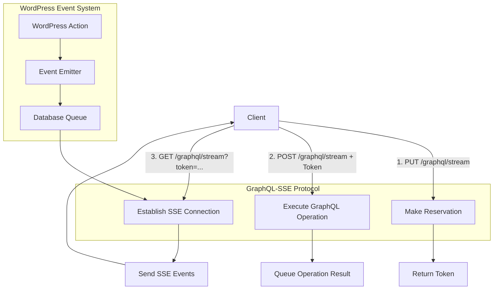
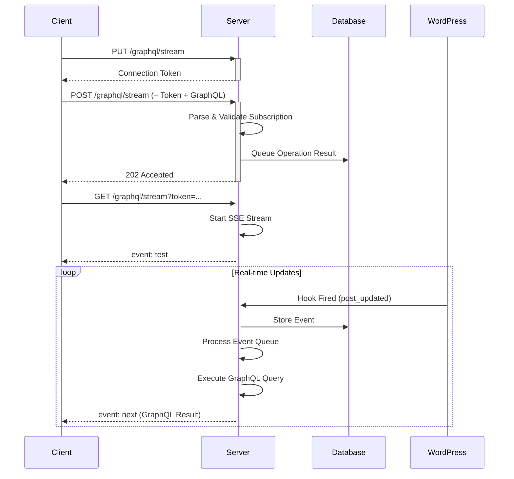

# Architecture Overview

## System Design

WPGraphQL Subscriptions implements a **GraphQL-SSE protocol compliant** system with **database-backed event queue** and **Server-Sent Events (SSE)** transport to provide real-time GraphQL subscriptions without external dependencies.

The system follows the [GraphQL-SSE specification](https://github.com/enisdenjo/graphql-sse/blob/master/PROTOCOL.md) for standardized GraphQL subscription handling over HTTP.

## High-Level Flow



## GraphQL-SSE Protocol Implementation

### Protocol Compliance

The system implements the complete GraphQL-SSE specification with three distinct HTTP operations:

1. **Reservation (PUT)** - Creates a connection token
2. **Operation Execution (POST)** - Queues GraphQL subscription operations  
3. **Event Stream (GET)** - Establishes SSE connection for real-time updates

### Connection Flow



### Message Types

- **`test`** - Connection establishment confirmation
- **`next`** - GraphQL subscription results with full field resolution
- **`complete`** - Subscription completion (not yet implemented)

## Core Components

### 1. GraphQL-SSE Protocol Handler

**File**: `includes/event-stream.php`

Handles the three GraphQL-SSE HTTP methods:
- `PUT` - Token generation and reservation management
- `POST` - GraphQL operation parsing and queuing
- `GET` - SSE stream establishment and event delivery

### 2. Event Emission Layer

**File**: `includes/class-wpgraphql-event-emitter.php`

Provides a centralized event emission system that:
- Standardizes event payloads across different WordPress hooks
- Maps WordPress actions to GraphQL subscription types
- Validates and enriches event data
- Triggers the `graphql_subscription_event` action

**Example Usage**:
```php
WPGraphQL_Event_Emitter::emit(
    'post',           // node_type
    'UPDATE',         // action
    $post_id,         // node_id
    ['post' => $post], // context
    ['hook' => 'wp_insert_post'] // metadata
);
```

### 2. Database Event Queue

**File**: `includes/class-wpgraphql-event-queue.php`

A custom database table (`wp_wpgraphql_subscription_events`) that stores events for reliable multi-process delivery:

```sql
CREATE TABLE wp_wpgraphql_subscription_events (
    id bigint(20) unsigned NOT NULL AUTO_INCREMENT,
    subscription_type varchar(50) NOT NULL,
    node_id bigint(20) unsigned NULL,
    event_data longtext NOT NULL,
    created_at datetime NOT NULL,
    processed_at datetime NULL,
    PRIMARY KEY (id),
    KEY idx_subscription_type (subscription_type),
    KEY idx_created_at (created_at),
    KEY idx_node_id (node_id)
);
```

**Key Features**:
- Time-based event retrieval (events since timestamp)
- Automatic cleanup of old events
- Optimized indexes for fast lookups
- JSON storage of complete event payloads

### 3. SSE Stream Handler

**File**: `includes/class-wpgraphql-subscriptions-stream.php`

Manages long-running HTTP connections using Server-Sent Events with full GraphQL integration:

**Responsibilities**:
- **GraphQL Query Execution** - Executes subscription queries through WPGraphQL's engine
- **Field Resolution** - Proper WPGraphQL field resolution with permissions and transformations
- **Event Processing** - Converts WordPress events to GraphQL execution results
- **Connection Management** - Token validation, session handling, and lifecycle management
- **Output Buffer Control** - Aggressive flushing for real-time delivery
- **Error Handling** - Comprehensive logging and error recovery

**Connection Flow**:
1. Client connects to `/graphql/stream?token=connection_token`
2. Stream validates token and closes PHP session to prevent blocking
3. Stream sends initial `test` event for connection confirmation
4. Stream enters polling loop (1-second intervals)
5. Stream queries database for events since last check
6. Stream executes GraphQL queries for each event
7. Stream sends resolved data as SSE `next` events to client

### 4. WordPress Integration

**File**: `includes/events.php`

Hooks into WordPress actions to emit subscription events:

```php
add_action('post_updated', function($post_id, $post_after, $post_before) {
    WPGraphQL_Event_Emitter::emit('post', 'UPDATE', $post_id, [
        'post' => $post_after,
        'post_type' => $post_after->post_type
    ]);
});
```

### 5. GraphQL Schema Integration

**File**: `includes/schema.php`

Extends WPGraphQL schema with subscription support:

```php
register_graphql_object_type('RootSubscription', [
    'description' => 'Root subscription type',
    'fields' => []
]);

register_graphql_field('RootSubscription', 'postUpdated', [
    'type' => 'Post',
    'args' => ['id' => ['type' => 'ID']],
    'resolve' => function($root, $args) {
        return new \WPGraphQL\Model\Post(get_post($args['id']));
    }
]);
```

### 6. Subscription Storage System

**Files**: 
- `includes/interface-wpgraphql-subscription-storage.php` - Storage interface
- `includes/class-wpgraphql-subscription-database-storage.php` - Database implementation
- `includes/class-wpgraphql-subscription-connection.php` - Connection management
- `includes/class-wpgraphql-connection-manager.php` - Connection manager

The subscription storage system provides **cross-process persistence** for GraphQL subscription documents:

```php
// Storage Interface (Swappable Backends)
interface WPGraphQL_Subscription_Storage_Interface {
    public function store_connection($token, $expires_at = null);
    public function store_subscription($token, $operation_id, $query, $variables = []);
    public function get_subscriptions($token);
    public function cleanup_expired_connections();
}

// Database Implementation
class WPGraphQL_Subscription_Database_Storage {
    // Uses two tables:
    // - wp_wpgraphql_subscription_connections (token, created_at, expires_at)
    // - wp_wpgraphql_subscription_documents (token, operation_id, query, variables)
}
```

**Connection Lifecycle**:
1. **PUT Request**: Creates connection record in database with 24-hour expiry
2. **POST Request**: Stores subscription document linked to connection token  
3. **GET Request**: Retrieves stored subscriptions for event matching
4. **Expiry**: Hourly cleanup removes expired connections and documents

**Cross-Process Benefits**:
- PUT, POST, and GET requests can run in different PHP processes
- All processes share the same database storage
- No memory-based storage limitations
- Automatic cleanup prevents storage bloat

## Multi-Process Architecture

### Problem Solved

Traditional caching approaches (transients, object cache) fail in multi-process environments because:
- Each PHP-FPM worker has isolated memory
- Object caches aren't shared between processes
- Race conditions occur during concurrent access

### Solution: Database-Centric Design

```
Process 1 (SSE Stream A) ──┐
                           ├──> Database Queue ──> All Events
Process 2 (SSE Stream B) ──┘

Process 3 (Event Emission) ──> Database Queue
```

**Benefits**:
- All processes share the same database
- No cache invalidation issues
- Atomic database operations prevent race conditions
- Horizontal scaling across multiple PHP-FPM workers

## Event Lifecycle

### 1. Event Creation
```
WordPress Hook → Event Emitter → Database Insert
```

### 2. Event Delivery
```
SSE Stream Poll → Database Query → Event Conversion → Client Delivery
```

### 3. Event Cleanup
```
Cron Job → Delete Old Events (1+ hours old)
```

## Performance & Scaling Architecture

### Database Load Analysis

The current database-centric design creates specific load patterns that must be considered for production deployments:

#### Write Load (Event Emission)
```
WordPress Event → Database INSERT → Event Queue Growth
```

**Load Characteristics**:
- **Frequency**: Every WordPress action (post updates, comments, user changes)
- **Volume**: Potentially hundreds/thousands of writes per minute on busy sites
- **Growth**: Event table grows continuously until cleanup

#### Read Load (SSE Connections)
```
SSE Connection → Database SELECT (every 1 second) → Event Processing
```

**Load Characteristics**:
- **Frequency**: Every second per active SSE connection
- **Concurrency**: Multiplied by number of active connections
- **Pattern**: `SELECT * FROM events WHERE created_at > ?` + `SELECT * FROM subscriptions WHERE token = ?`

### Scaling Bottlenecks

#### Database Connection Pool Exhaustion
```
10 SSE connections × 1 query/second = 10 DB connections constantly in use
100 SSE connections × 1 query/second = 100 DB connections (likely exceeds pool)
```

#### Query Performance Degradation
```sql
-- This query gets slower as event table grows
SELECT * FROM wp_wpgraphql_subscription_events 
WHERE created_at > '2025-08-07 20:00:00' 
ORDER BY created_at ASC;

-- Index required on created_at for performance
CREATE INDEX idx_events_created_at ON wp_wpgraphql_subscription_events(created_at);
```

#### Storage Growth Issues
```sql
-- Event table can grow rapidly
-- 1000 events/hour × 24 hours = 24,000 rows/day
-- Without cleanup: 8.7M rows/year
```

### Storage Backend Comparison

| Aspect | Database | Redis | Memcached |
|--------|----------|-------|-----------|
| **Read Speed** | ~1-10ms | ~0.1ms | ~0.1ms |
| **Write Speed** | ~1-10ms | ~0.1ms | ~0.1ms |
| **Concurrent Connections** | Limited by pool | Thousands | Thousands |
| **Automatic Expiry** | Manual cleanup | TTL built-in | TTL built-in |
| **Multi-server** | Shared DB | Shared instance | Shared instance |
| **Memory Usage** | Disk-based | RAM-based | RAM-only |
| **Persistence** | Durable | Optional | None |
| **Setup Complexity** | None (WordPress) | Moderate | Low |

### Recommended Architecture by Scale

#### Development & Small Sites (< 10 connections)
```
WordPress → Database Tables → SSE Streams
```
- **Storage**: Database (current implementation)
- **Cleanup**: Hourly cron job
- **Monitoring**: Basic WordPress logs

#### Medium Sites (10-100 connections)
```
WordPress → Database + Optimizations → SSE Streams
```
- **Storage**: Database with optimized indexes
- **Cleanup**: 15-minute intervals
- **Monitoring**: Database performance metrics
- **Optimizations**: Connection pooling, query caching

#### Large Sites (100+ connections)
```
WordPress → Redis/External Storage → SSE Streams
```
- **Storage**: Redis or Memcached
- **Cleanup**: TTL-based automatic expiry
- **Monitoring**: Redis metrics + application monitoring
- **Architecture**: Load-balanced, multi-server capable

### Migration Strategy

#### Phase 1: Database Optimization
```php
// Add proper indexes
CREATE INDEX idx_events_created_at ON wp_wpgraphql_subscription_events(created_at);
CREATE INDEX idx_connections_expires ON wp_wpgraphql_subscription_connections(expires_at);
CREATE INDEX idx_docs_token ON wp_wpgraphql_subscription_documents(connection_token);

// Optimize cleanup frequency
wp_schedule_event(time(), 'every_15_minutes', 'wpgraphql_subscription_cleanup');
```

#### Phase 2: External Storage
```php
// Implement Redis storage
class WPGraphQL_Subscription_Redis_Storage implements WPGraphQL_Subscription_Storage_Interface {
    private $redis;
    
    public function __construct($config) {
        $this->redis = new Redis();
        $this->redis->connect($config['host'], $config['port']);
    }
    
    public function store_connection($token, $expires_at = null) {
        $ttl = $expires_at ? strtotime($expires_at) - time() : 86400;
        return $this->redis->setex("conn:{$token}", $ttl, json_encode([
            'created_at' => time(),
            'expires_at' => $expires_at
        ]));
    }
    
    // ... implement other interface methods
}

// Enable Redis storage
add_filter('wpgraphql_subscription_storage', function() {
    if (class_exists('Redis')) {
        return new WPGraphQL_Subscription_Redis_Storage([
            'host' => REDIS_HOST,
            'port' => REDIS_PORT
        ]);
    }
    return new WPGraphQL_Subscription_Database_Storage(); // Fallback
});
```

## Transport Layer: Server-Sent Events

### Why SSE?

1. **HTTP-based** - Works through firewalls and proxies
2. **Automatic reconnection** - Built into browsers
3. **Simple implementation** - No complex WebSocket handshaking
4. **WordPress-compatible** - Works with standard web servers

### SSE Protocol Implementation

```
Content-Type: text/event-stream
Cache-Control: no-cache
Connection: keep-alive

event: next
data: {"data": {"postUpdated": {"id": 123, "title": "Updated Post"}}}

event: heartbeat  
data: {"time": "2025-08-07T18:22:23Z", "pid": 1234}
```

### Client Handling

```javascript
const eventSource = new EventSource('/stream-endpoint');

eventSource.addEventListener('next', function(event) {
    const result = JSON.parse(event.data);
    // Handle GraphQL subscription result
});

eventSource.addEventListener('heartbeat', function(event) {
    const status = JSON.parse(event.data);
    // Connection keepalive
});
```

## Scaling Considerations

### Current Limits

- **PHP-FPM Worker Pool** - Limited by `pm.max_children` setting
- **Database Connections** - Limited by MySQL connection pool
- **Memory Usage** - Each SSE stream consumes one PHP process

### Scaling Strategies

1. **Horizontal PHP-FPM Scaling**
   ```ini
   pm.max_children = 50-100
   pm.start_servers = 10-20
   ```

2. **Database Optimization**
   ```sql
   -- Optimize event queries
   KEY idx_subscription_type_created (subscription_type, created_at)
   
   -- Regular cleanup
   DELETE FROM events WHERE created_at < NOW() - INTERVAL 1 HOUR
   ```

3. **Event Queue Partitioning** (Future)
   - Separate tables by subscription type
   - Redis/external queue for high-volume scenarios

## Security Model

### Current Implementation
- No authentication on SSE endpoints (development mode)
- Events contain full WordPress post data
- No rate limiting or connection restrictions

### Production Requirements
- User authentication for subscription endpoints
- Permission-based event filtering
- Rate limiting per connection
- Data sanitization in event payloads

## Monitoring and Debugging

### Built-in Tools

1. **Admin Interface** - `GraphQL → Subscription Queue`
2. **WP-CLI Commands** - `wp wpgraphql subscription stats`  
3. **Error Logging** - Detailed logs for event flow
4. **Database Queries** - Direct access to event queue table

### Key Metrics

- Total events in queue
- Events per hour
- Active SSE connections (via PHP process monitoring)
- Average event processing time

## Future Architecture Improvements

### 1. Event Filtering
Replace broadcast model with subscription-aware filtering:
```php
// Store subscription parameters
$subscription = [
    'query' => 'subscription { postUpdated(id: 123) { title } }',
    'variables' => ['id' => 123]
];

// Filter events during retrieval
$events = $queue->get_events_for_subscription($subscription);
```

### 2. Connection Management
Track active connections and their subscription state:
```sql
CREATE TABLE wp_wpgraphql_active_connections (
    connection_id varchar(255),
    user_id bigint(20),
    subscription_hash varchar(64),
    created_at datetime,
    last_seen datetime
);
```

### 3. Transport Abstraction
Support multiple transport methods:
```php
interface TransportInterface {
    public function send_event($connection_id, $event_data);
    public function close_connection($connection_id);
}

class SSETransport implements TransportInterface { ... }
class WebSocketTransport implements TransportInterface { ... }
```

This architecture provides a solid foundation for real-time GraphQL subscriptions while maintaining WordPress compatibility and avoiding external dependencies.