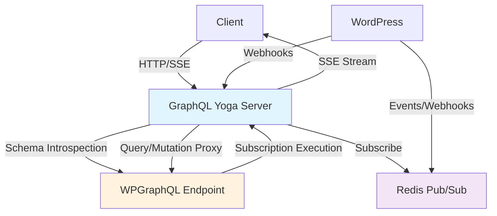

# GraphQL Yoga Sidecar Architecture

## Overview

This document outlines the architecture for a GraphQL Yoga sidecar server that provides real-time subscription capabilities for WPGraphQL while respecting the existing PHP-based schema and resolvers.

## Core Principles

1. **Schema Authority**: WPGraphQL remains the authoritative source for the GraphQL schema
2. **Resolver Delegation**: All query and mutation resolvers proxy to WPGraphQL
3. **Subscription Augmentation**: Subscription fields get programmatically added `subscribe` methods
4. **Event-Driven**: WordPress events trigger pub/sub messages that drive subscription updates

## Architecture Components



## Data Flow

### 1. Schema Discovery
```
GraphQL Yoga → Introspect WPGraphQL → Cache Schema → Apply Subscription Methods
```

### 2. Client Subscription
```
Client → HTTP POST (subscription) → SSE Stream Established → Parse Subscription → Extract Channel → Subscribe to Pub/Sub
```

### 3. Event Processing (Existing System Integration)
```
WordPress Event → WPGraphQL_Event_Emitter::emit() → graphql_subscription_event hook → Redis Publish/Webhook → Yoga Receives → Execute Subscription → SSE Event to Client
```

## Subscription Framework Constraints

### Single Argument Pattern (Phase 1)
To maintain predictability and avoid complex channel mapping, we'll start with a constraint:
**Subscriptions can have 0 or 1 arguments maximum**

### Channel Naming Strategy
```
{subscriptionName}[.{argumentValue}]
```

### Examples
```javascript
// Specific resource subscription
postUpdated(id: "123") → "postUpdated.123"

// Global subscription (no arguments)
postCreated() → "postCreated"

// User-specific subscription
userUpdated(id: "456") → "userUpdated.456"
```

### Broad Channel + Server-side Filtering
For more complex filtering, we'll use broader channels and let WPGraphQL filter:
- Subscribe to `postUpdated` (global channel)
- WordPress publishes all post updates to this channel
- GraphQL Yoga executes subscription with event payload as `root_value`
- WPGraphQL resolver filters based on subscription arguments

## Key Components

### 1. Schema Manager
- Introspects WPGraphQL schema periodically (every 5 minutes)
- Receives webhook notifications for immediate schema updates
- Caches schema with TTL
- Detects subscription fields and validates single-argument constraint
- Applies subscribe methods programmatically

### 2. Subscription Manager
- Parses subscription documents
- Extracts channel names from arguments
- Manages active subscriptions
- Handles subscription lifecycle

### 3. Event Processor
- Listens to Redis pub/sub channels
- Matches events to active subscriptions
- Executes subscription queries against WPGraphQL with event payload as `root_value`
- Filters out null responses from WPGraphQL
- Forwards successful results to SSE clients

### 4. Proxy Handler
- Forwards queries/mutations to WPGraphQL
- Handles authentication passthrough
- Manages HTTP client connection pooling

## Configuration

### Environment Variables
```bash
WPGRAPHQL_ENDPOINT=http://wordpress:8080/graphql
REDIS_URL=redis://redis:6379
SCHEMA_CACHE_TTL=300
SUBSCRIPTION_TIMEOUT=30000
```

### WordPress Integration
```php
// WordPress uses existing WPGraphQL_Event_Emitter system
WPGraphQL_Event_Emitter::emit(
    'post',           // node_type
    'UPDATE',         // action
    $post_id,         // node_id
    [                 // context
        'post' => $post_after,
        'post_type' => $post_after->post_type,
    ],
    [                 // metadata
        'hook' => 'post_updated',
    ]
);

// This triggers the standardized action hook
do_action('graphql_subscription_event', 'postUpdated', $event_payload);

// Event handlers can route to Redis, webhooks, etc.
add_action('graphql_subscription_event', function($subscription_type, $payload) {
    // Route to Redis (sidecar integration)
    if (defined('WPGRAPHQL_REDIS_ENABLED') && WPGRAPHQL_REDIS_ENABLED) {
        wp_graphql_redis_publish($subscription_type, $payload);
    }
    
    // Route to webhook (existing implementation)
    if (defined('WPGRAPHQL_YOGA_WEBHOOK_URL')) {
        wp_remote_post(WPGRAPHQL_YOGA_WEBHOOK_URL, [
            'body' => wp_json_encode([
                'channel' => $subscription_type,
                'payload' => $payload
            ]),
            'headers' => ['Content-Type' => 'application/json']
        ]);
    }
});
```

## Error Handling

1. **WPGraphQL Unavailable**: Return connection error, trigger client disconnect for retry
2. **Subscription Permission Denied**: 
   - If WPGraphQL returns null: Filter out silently (no message sent)
   - If WPGraphQL returns GraphQL error: Forward error to client
3. **Schema Changes Break Subscription**: 
   - Re-introspect schema immediately
   - Retry subscription execution
   - If still fails, send GraphQL validation error to client
4. **Redis Connection Lost**: Attempt reconnection, pause new subscriptions

## Security Considerations

1. **Authentication**: Forward JWT tokens from SSE request headers to WPGraphQL
2. **Authorization**: Let WPGraphQL handle all permission checks
3. **Rate Limiting**: Implement per-connection subscription limits
4. **Input Validation**: Validate subscription documents before processing

## Transport Integration

### Existing Webhook Transport
The current implementation already includes webhook transport in `transport-webhook.php`:

```php
// Existing webhook implementation
add_action('graphql_subscription_event', function($event_type, $payload) {
    wp_remote_post('https://webhook.site/ca82a28f-485e-4f53-a716-3dcac8d303ea', [
        'headers' => ['Content-Type' => 'application/json'],
        'body' => json_encode($payload),
    ]);
}, 10, 2);
```

### Sidecar Redis Integration
The sidecar will add Redis transport alongside the existing webhook:

```php
// Add Redis transport for sidecar
add_action('graphql_subscription_event', function($event_type, $payload) {
    if (defined('WPGRAPHQL_REDIS_ENABLED') && WPGRAPHQL_REDIS_ENABLED) {
        wp_graphql_redis_publish($event_type, $payload);
    }
}, 10, 2);
```

## SSE Implementation Details

### GraphQL Yoga SSE Configuration
```typescript
import { createYoga } from 'graphql-yoga'

const yoga = createYoga({
  schema: proxiedSchema,
  // SSE is enabled by default for subscriptions
  graphqlEndpoint: '/graphql',
  subscriptionsProtocol: 'SSE', // Server-Sent Events
  cors: {
    origin: ['http://localhost:3000'], // Configure as needed
    credentials: true
  }
})
```

### Client SSE Connection
```javascript
// Client establishes SSE connection for subscriptions
const subscription = `
  subscription PostUpdated($id: ID!) {
    postUpdated(id: $id) {
      id
      title
      content
    }
  }
`;

fetch('/graphql', {
  method: 'POST',
  headers: {
    'Content-Type': 'application/json',
    'Accept': 'text/event-stream',
    'Authorization': 'Bearer jwt-token-here'
  },
  body: JSON.stringify({
    query: subscription,
    variables: { id: '123' }
  })
}).then(response => {
  const reader = response.body.getReader();
  // Process SSE events...
});
```

## Performance Optimizations

1. **Schema Caching**: Cache introspected schema to reduce WPGraphQL load
2. **Connection Pooling**: Reuse HTTP connections to WPGraphQL
3. **Subscription Batching**: Group multiple subscription executions
4. **Event Deduplication**: Avoid duplicate events for same subscription
5. **SSE Connection Management**: Efficiently handle long-lived SSE connections

## Deployment Considerations

1. **Horizontal Scaling**: Multiple Yoga instances can share Redis
2. **Health Checks**: Implement readiness/liveness probes
3. **Monitoring**: Track subscription counts, event processing latency
4. **Graceful Shutdown**: Close SSE connections cleanly
