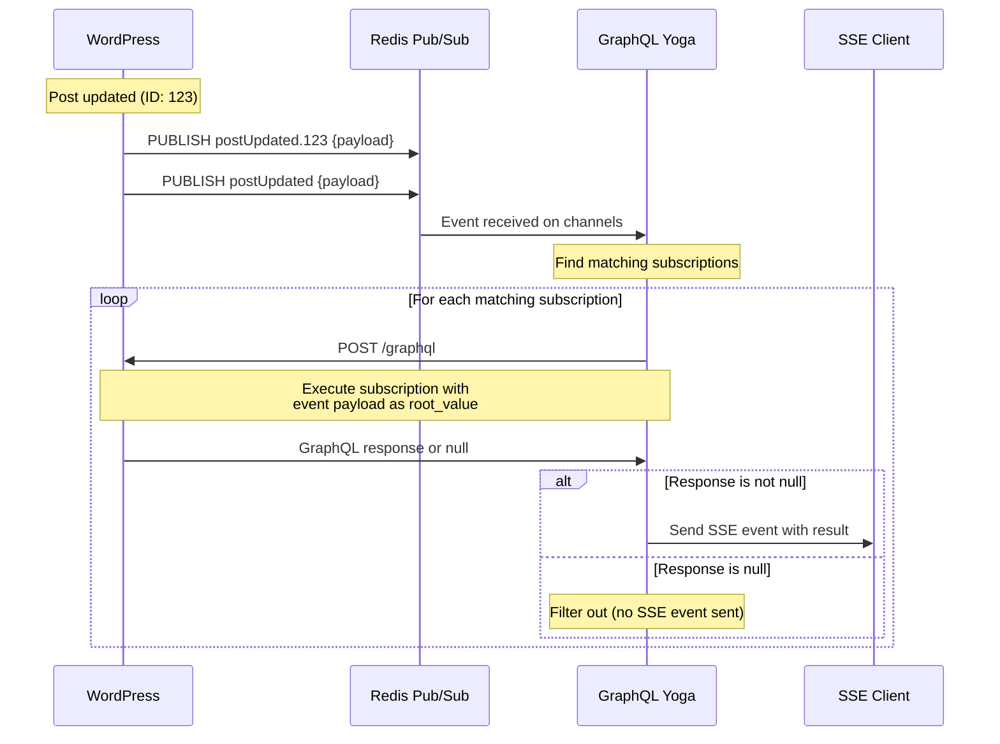

# Subscription Execution Flow

## Overview

This document details how subscription events flow from WordPress through the GraphQL Yoga server back to WPGraphQL for execution, using the event payload as `root_value` for filtering and resolution.

## Execution Flow



## GraphQL Execution Pattern

### Yoga Server → WPGraphQL Request
```typescript
// When event received from Redis
async function executeSubscription(subscription: ActiveSubscription, eventPayload: any) {
  const response = await fetch(`${WPGRAPHQL_ENDPOINT}/graphql`, {
    method: 'POST',
    headers: {
      'Content-Type': 'application/json',
      'Authorization': `Bearer ${subscription.authToken}`, // Forward JWT from SSE headers
      ...subscription.headers
    },
    body: JSON.stringify({
      query: subscription.document,        // Original subscription query
      variables: subscription.variables,   // Original variables
      operationName: subscription.operationName,
      extensions: {
        subscriptionExecution: {
          eventPayload: eventPayload,      // Event data as context
          isSubscription: true
        }
      }
    })
  });

  return await response.json();
}
```

### WPGraphQL Subscription Processing

#### 1. Detect Subscription Execution Context
```php
add_filter('graphql_request_data', function($request_data) {
    if (isset($request_data['extensions']['subscriptionExecution'])) {
        // Store event payload for subscription resolvers
        add_filter('graphql_subscription_event_payload', function() use ($request_data) {
            return $request_data['extensions']['subscriptionExecution']['eventPayload'];
        });
        
        // Set event payload as root value for subscription fields
        add_filter('graphql_resolve_field', function($result, $source, $args, $context, $info) use ($request_data) {
            if ($info->parentType->name === 'Subscription' && $source === null) {
                // For subscription root fields, use event payload as source
                return resolve_subscription_field(
                    $request_data['extensions']['subscriptionExecution']['eventPayload'],
                    $args,
                    $context,
                    $info
                );
            }
            return $result;
        }, 10, 5);
    }
    
    return $request_data;
});
```

#### 2. Subscription Field Resolvers (Current Implementation)
```php
// Current postUpdated resolver in schema.php
register_graphql_field('RootSubscription', 'postUpdated', [
    'description' => __('Subscription for post updates.', 'wpgraphql-subscriptions'),
    'type' => 'Post',
    'args' => [
        'id' => [
            'type' => 'ID',
            'description' => __('The ID of the post to subscribe to.', 'wpgraphql-subscriptions'),
        ],
    ],
    'resolve' => function($root, $args, $context, $info) {
        // Get the requested post ID from subscription arguments
        $requested_id = isset($args['id']) ? absint($args['id']) : null;
        
        // If we have post data from the subscription event, return it
        if (isset($root['postUpdated'])) {
            $post_data = $root['postUpdated'];
            
            // If we have a WP_Post object directly, check if it matches the requested ID
            if (is_object($post_data) && isset($post_data->ID)) {
                // Filter: only return if this post matches the subscribed ID
                if ($requested_id && $post_data->ID != $requested_id) {
                    return null; // Filter out non-matching posts
                }
                
                return new \WPGraphQL\Model\Post($post_data);
            }
        }
        
        return null; // For initial subscription setup or filtered events
    }
]);
```

function resolve_post_updated_subscription($eventPayload, $args, $context) {
    // Extract post ID from event payload
    $eventPostId = $eventPayload['node_id'] ?? null;
    if (!$eventPostId) {
        return null;
    }
    
    // If subscription has ID filter, check if it matches
    if (isset($args['id'])) {
        $subscriptionPostId = \GraphQLRelay\Relay::fromGlobalId($args['id'])['id'];
        if ($subscriptionPostId !== $eventPostId) {
            return null; // Filter out - doesn't match subscription
        }
    }
    
    // Check permissions
    if (!current_user_can('read_post', $eventPostId)) {
        return null; // Filter out - no permission
    }
    
    // Load fresh post data
    $post = get_post($eventPostId);
    if (!$post || $post->post_status !== 'publish') {
        return null; // Filter out - post not available
    }
    
    // Return post for GraphQL resolution
    return $post;
}
```

## Event Payload Structure

### Standard Event Payload (Existing Implementation)
```php
// Generated by WPGraphQL_Event_Emitter::emit()
$eventPayload = [
    'node_type' => 'post',           // Type of resource
    'action' => 'UPDATE',            // CREATE, UPDATE, DELETE
    'node_id' => 123,                // Resource ID
    'context' => [                   // Context data passed to emit()
        'post' => $post_after,       // The actual post object
        'post_type' => $post_after->post_type,
    ],
    'metadata' => [                  // Auto-generated + custom metadata
        'timestamp' => time(),       // When event occurred
        'event_id' => uniqid('post_UPDATE_', true), // Unique event ID
        'user_id' => get_current_user_id(), // Who triggered the event
        'hook' => 'post_updated'     // WordPress hook that fired (custom)
    ]
];
```

## Filtering Strategies

### 1. ID-Based Filtering (Most Common)
```php
// Client: postUpdated(id: "cG9zdDoxMjM=")
// Channel: "postUpdated.123"

function resolve_post_updated_subscription($eventPayload, $args, $context) {
    if (isset($args['id'])) {
        $subscriptionId = \GraphQLRelay\Relay::fromGlobalId($args['id'])['id'];
        $eventId = $eventPayload['node_id'];
        
        if ($subscriptionId !== $eventId) {
            return null; // ID doesn't match
        }
    }
    
    return get_post($eventPayload['node_id']);
}
```

### 2. Broad Channel Filtering (Future)
```php
// Client: postUpdated(where: {authorId: 123, status: "PUBLISH"})
// Channel: "postUpdated" (broad channel)

function resolve_post_updated_subscription($eventPayload, $args, $context) {
    $post = get_post($eventPayload['node_id']);
    
    // Apply where clause filters
    if (isset($args['where']['authorId'])) {
        $authorId = \GraphQLRelay\Relay::fromGlobalId($args['where']['authorId'])['id'];
        if ($post->post_author != $authorId) {
            return null; // Author doesn't match
        }
    }
    
    if (isset($args['where']['status'])) {
        if (strtolower($post->post_status) !== strtolower($args['where']['status'])) {
            return null; // Status doesn't match
        }
    }
    
    return $post;
}
```

## Error Handling Patterns

### 1. Permission Denied (Silent Filter)
```php
function resolve_post_updated_subscription($eventPayload, $args, $context) {
    $postId = $eventPayload['node_id'];
    
    // Check permissions - return null if denied
    if (!current_user_can('read_post', $postId)) {
        return null; // Client won't receive any message
    }
    
    return get_post($postId);
}
```

### 2. Authentication Required (Explicit Error)
```php
function resolve_post_updated_subscription($eventPayload, $args, $context) {
    // Check authentication - throw error if not authenticated
    if (!is_user_logged_in()) {
        throw new \GraphQL\Error\UserError('Authentication required for post subscriptions');
    }
    
    return get_post($eventPayload['node_id']);
}
```

### 3. Resource Not Found (Silent Filter)
```php
function resolve_post_updated_subscription($eventPayload, $args, $context) {
    $post = get_post($eventPayload['node_id']);
    
    // Return null if post doesn't exist or isn't published
    if (!$post || $post->post_status !== 'publish') {
        return null; // Filter out
    }
    
    return $post;
}
```

## GraphQL Yoga Response Handling

### Processing WPGraphQL Response
```typescript
async function handleSubscriptionResult(result: any, subscription: ActiveSubscription) {
    // Handle GraphQL errors (authentication, validation, etc.)
    if (result.errors && result.errors.length > 0) {
        // Check if it's an authentication error
        const hasAuthError = result.errors.some(error => 
            error.message.includes('Authentication required') ||
            error.extensions?.code === 'UNAUTHENTICATED'
        );
        
        if (hasAuthError) {
            // Close subscription and send error event
            await closeSubscription(subscription.id);
            sendSSEEvent(subscription.connectionId, 'error', { 
                message: 'Authentication expired' 
            });
            return;
        }
        
        // Other errors - send error event but keep subscription alive
        sendSSEEvent(subscription.connectionId, 'error', result.errors);
        return;
    }
    
    // Handle successful response
    if (result.data) {
        // Check if all subscription fields returned null (filtered out)
        const allNull = Object.values(result.data).every(value => value === null);
        
        if (allNull) {
            // Silent filter - don't send any SSE event
            return;
        }
        
        // Send successful result as SSE event
        sendSSEEvent(subscription.connectionId, 'next', result);
    }
}
```

## Performance Considerations

### 1. Reduce Unnecessary Executions
- Use specific channels when possible (`postUpdated.123` vs `postUpdated`)
- Cache subscription validation results
- Batch multiple events for same subscription

### 2. Optimize WPGraphQL Calls
- Use HTTP keep-alive connections
- Implement connection pooling
- Add request timeouts and retries

### 3. Memory Management
- Clean up completed subscriptions
- Limit concurrent subscription executions
- Monitor GraphQL execution time

## Testing Strategies

### Unit Tests
```typescript
describe('Subscription Execution', () => {
  it('should filter out null responses', async () => {
    const mockResult = { data: { postUpdated: null } };
    const result = await handleSubscriptionResult(mockResult, mockSubscription);
    expect(result).toBeUndefined(); // No message sent
  });

  it('should forward authentication errors', async () => {
    const mockResult = { 
      errors: [{ message: 'Authentication required' }] 
    };
    const result = await handleSubscriptionResult(mockResult, mockSubscription);
    expect(mockCloseSubscription).toHaveBeenCalled();
  });
});
```

### Integration Tests
```php
class SubscriptionExecutionTest extends WP_UnitTestCase {
    public function test_post_updated_subscription_filters_by_id() {
        $eventPayload = ['node_id' => 123];
        $args = ['id' => \GraphQLRelay\Relay::toGlobalId('Post', 456)];
        
        $result = resolve_post_updated_subscription($eventPayload, $args, []);
        $this->assertNull($result); // Should filter out non-matching ID
    }
}
```
